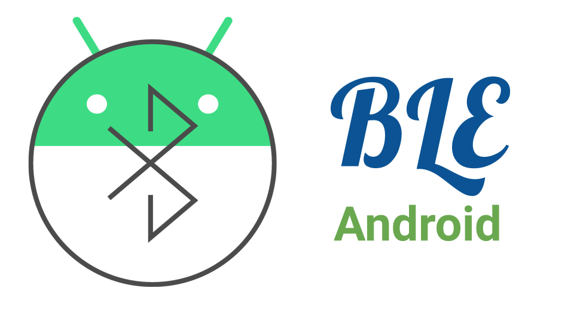
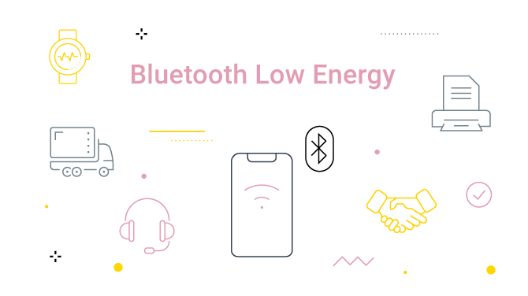

<p align="center">
  
</p>

<h3 align="center">Bluetooth Low Energy (BLE) Made Easy for Android</h3>

<br>

<p align="center">
  
  
  
  
  <br>
  
</p>

<p align="center">
  
</p>

## How to Use
The template has 3 separate modules. 
  - The **`app`** module contains all the UI related code.
  - The **`core`** module contains all the common dependencises and base classes used by other modules.
  - The **`ble`** module contains all the code required for BLE applications.
  
The **`ble`** module provides 2 easy to use interfaces **(BleUtils and BleManager)** for implementating BLE tasks. It uses [Dagger-Hilt](https://developer.android.com/training/dependency-injection/hilt-android) for providing the interfaces. Use the **@Inject** annotation for injecting these interfaces into your `ViewModels`, `Fragments` or `Activities`.

Example injection in an Activity:
``` kotlin

@AndroidEntryPoint
class MainActivity : ComponentActivity() {

    @Inject
    lateinit var bleUtils: BleUtils
    ...
}

```

Example injection in a ViewModel:
``` kotlin

@HiltViewModel
class MyViewModel @Inject constructor(
    private val bleManager: BleManager
) : ViewModel() {
    ...
}

```


### 1. BleUtils
This interface provides utilities for **Permission Management** and **Enabling Bluetooth**.

``` kotlin

  interface BleUtils {

      fun initialize(activity: ComponentActivity, onSuccess: () -> Unit)
      fun isAllPermissionsProvided(activity: ComponentActivity): Boolean
      fun setupBluetooth(activity: ComponentActivity)

  }

```
  - `initialize`: Initializes the callbacks for permission/bluetooth enable request. **MUST** be called in the **onCreate()** method of the lifecycle before calling `setupBluetooth`.
  - `isAllPermissionsProvided`: (Optional) For checking if all the permissions are granted for using Bluetooth.
  - `setupBluetooth`: Asks for permission if not granted already and enables bluetooth if not already. Should be called in the **onResume()** method.


### 2. BleManager
This interface provides utilities for BLE I/O operations.

``` kotlin

interface BleManager {

    val loading: LiveData<Event<Boolean>>

    fun setBleCallbacks(
        onDeviceFound: (BleDevice) -> Unit,
        onConnectionChange: (ConnectionStatus) -> Unit,
        onServiceDiscovered: (List<BleService>) -> Unit,
        onCharacteristicRead: (BleCharacteristic) -> Unit,
        onCharacteristicChange: (BleCharacteristic) -> Unit,
        onCharacteristicWrite: (BleCharacteristic) -> Unit = {}
    )

    fun startScan()
    fun stopScan()
    fun connect(context: Context, address: String)
    fun disconnect()
    fun discoverServices()
    fun readCharacteristic(serviceUuid: String, charUuid: String)
    fun writeCharacteristic(serviceUuid: String, charUuid: String, payload: ByteArray)
    fun enableNotification(serviceUuid: String, charUuid: String)
    fun disableNotification(serviceUuid: String, charUuid: String)

}

```

The `loading` LiveData provides live update of any ongoing process. The BLE operations (discover/read/write) **MUST** be done sequentially. An operation can not be initiated while any othe roperation is going on. [The operations can be queued using a Queuing API](https://punchthrough.com/android-ble-guide/#:~:text=device%20from%20there.-,Implementing%20a%20basic%20queuing%20mechanism,-In%20this%20section). But that's more advanced and I wish to do that in the future.
The other functions are self explanatory in my opinion. Example implementation of these can be found in the [MainActivity](https://github.com/atick-faisal/BLE-Starter-Android/blob/main/app/src/main/kotlin/dev/atick/compose/MainActivity.kt).

#### A few important things to mention here:
  - The `setBleCallbacks` method should be called before doing any BLE operation. Otherwise there will be missed callback events.
  - Please call the `disconnect` method when you no longer need BLE to free up the resources.


## Big Thanks
Unfortunatelly the official Android BLE documentation is not clear enough and skips some of the important details. So a BIG THANKS goes to the authors of this [article](https://punchthrough.com/android-ble-guide) for breaking things down more clearly.

## Better Alternatives
This code was written with simplicity and readibility in mind and by no means the most optimized solution. But there are better alternatives:

  - [RxAndroidBle](http://polidea.github.io/RxAndroidBle/): Based on and requires knowledge of RxJava. Big, active community. This would be a good fit if a project follows the Rx paradigm. Huge bonus: RxAndroidBle is heavy on interfaces and therefore easily testable as they also provide mocked versions of their main interfaces.
  - [Nordic Android BLE Library](https://github.com/NordicSemiconductor/Android-BLE-Library): Nordic SDK is a great way to write embedded firmware. This library is their take on abstracting away the complexities and dangers of the official Android BLE SDK. Great community and contributors who are responsive to questions. Highly recommended.
  - [BleGattCoroutines](https://github.com/Beepiz/BleGattCoroutines): Based on and requires knowledge of Kotlin coroutines. This is a great library to use if you’re comfortable with Kotlin coroutines, or if your app uses a lot of it.
  - [SweetBlue](https://github.com/iDevicesInc/SweetBlue): SweetBlue was a popular library back in its 1.x and 2.x days, but it’s not free nor open source anymore since version 3.0. Nevertheless, this is based on conventional Java style callback interfaces, much like the APIs provided in the Android SDK, and should be the most beginner-friendly to start working with. If you’re a tinkerer, you can fork the project from its 2.x days, learn about its inner workings and customize it to your liking.


## License
[](https://creativecommons.org/licenses/by-nc-sa/4.0)

This work is licensed under [MIT License](https://github.com/atick-faisal/BLE-Starter-Android/blob/master/LICENSE).


